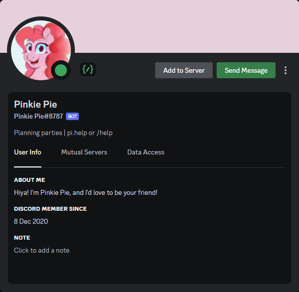

# Row-Bot
My 1st discord bot

This bot uses:
- PostgreSQL
- the TinyLlama small language language model using Ollama
- Node.js
- discord.js
- multiple APIs
- FFmpeg
- a truncated least frequently used and least recently used cache replacement policy
- rate limits with queueing
- custom intervals
- regular expressions
- sharding

Previous versions used:
- MongoDB
- custom AMP link pattern matching



Invite link:<br />
https://discord.com/oauth2/authorize?client_id=785922000723509298&permissions=8&scope=bot%20applications.commands

# Run
1. install the dependencies
2. edit the configs
3. run the command to start the bot

## Native
```bash
npm start
```

## Docker or Podman
### Docker
```bash
docker compose up
```

### Podman
```bash
podman compose up
```
